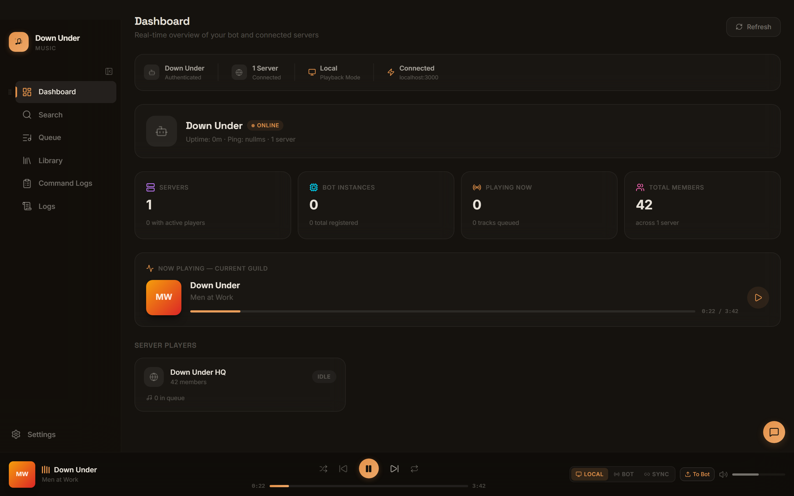
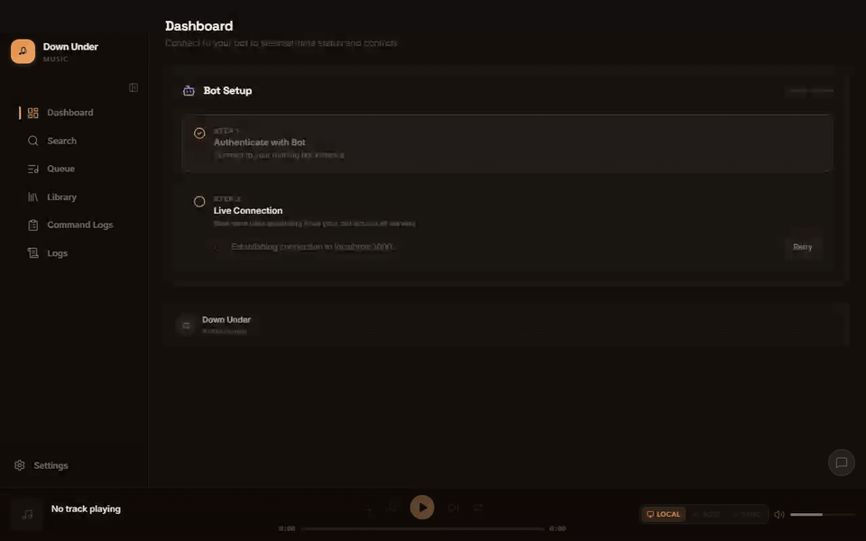
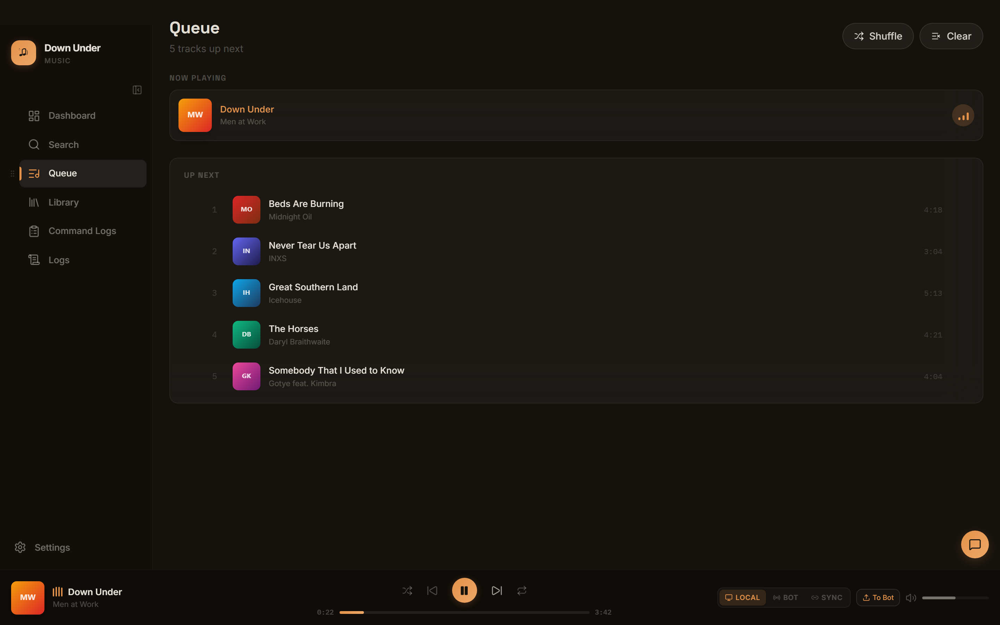
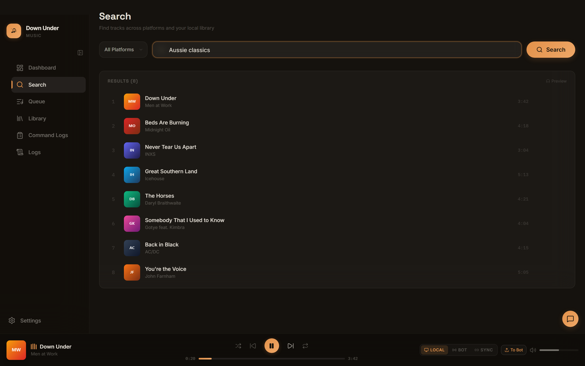
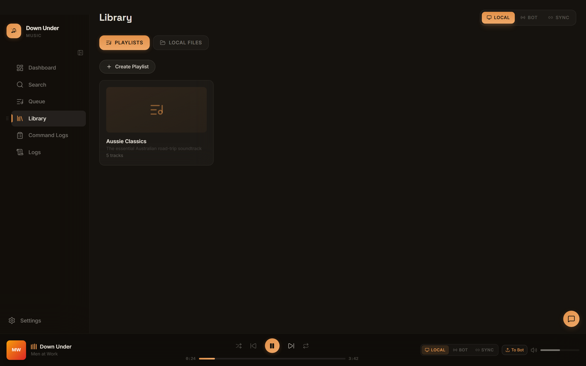
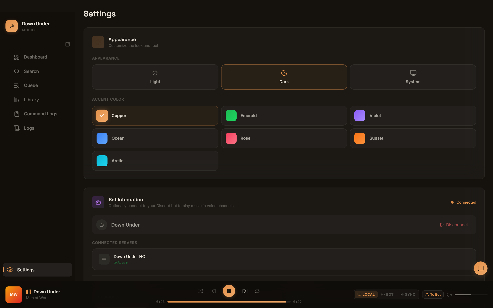
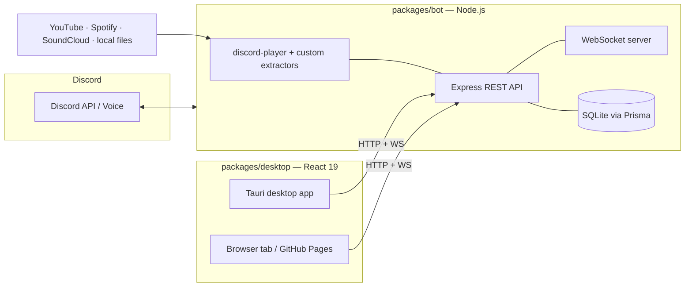

# Down Under Discord Bot

A multi-platform Discord music bot with a real dashboard — run it as a Tauri desktop app or a plain browser tab, backed by SQLite persistence and GitHub Actions CI/CD.

[](https://github.com/ChristopherVR/DownUnderDiscordBot/actions/workflows/ci.yml)
[](https://github.com/ChristopherVR/DownUnderDiscordBot/actions/workflows/deploy-pages.yml)
[](https://opensource.org/licenses/MIT)
[](https://nodejs.org/)
[](https://pnpm.io/)

**[Project site](https://christophervr.github.io/DownUnderDiscordBot/)** · **[Try the dashboard online](https://christophervr.github.io/DownUnderDiscordBot/dashboard/)** — connects to a bot instance you run yourself (nothing is hosted for you; see [Hosted Dashboard](#hosted-dashboard) below).



## See it in action

Search across platforms, queue tracks, and hit play — the player bar and queue update in real time:



|                                                                         |                                                                            |
| :---------------------------------------------------------------------: | :------------------------------------------------------------------------: |
|        |                  |
|            _Full queue management — reorder, shuffle, clear_            |                 _One search box across every music source_                 |
|  |  |
|               _Playlists and local files in one library_                |                _Themes, accent colors, and bot integration_                |

> Screenshots and GIF are captured from the real UI driving the bot's E2E test harness — regenerate them any time with [`packages/e2e/scripts/capture-assets.mjs`](packages/e2e/scripts/capture-assets.mjs) (see [docs/assets/README.md](docs/assets/README.md)).

## Features

- **Multi-platform music** — YouTube, Spotify (via YouTube bridge), SoundCloud, and local files
- **26 slash commands** — Full playback control, playlists, search, history, queue management
- **Dashboard, two ways** — a Tauri desktop app, or the same React frontend running standalone in any browser
- **Local / Bot / Sync playback modes** — play through your own speakers, through the bot's Discord voice connection, or both at once
- **Real-time sync** — WebSocket connection keeps the dashboard in sync with bot state
- **SQLite database** — Playlists, play history, queue snapshots, user preferences, track cache, command history
- **REST API** — 50+ endpoints for player control, queue, playlists, search, file uploads, auth, dashboard
- **E2E tested** — Playwright suite drives the real dashboard against a real bot in test mode
- **Local music** — Scan folders, parse ID3 tags, search by title/artist

## Architecture



```
DownUnderDiscordBot/
├── packages/
│   ├── bot/          # Discord bot + Express API server (Node.js/TypeScript)
│   ├── desktop/      # Dual-target dashboard: Tauri shell (Rust + React) or plain browser build
│   ├── shared/       # Shared types, localization, contracts
│   └── e2e/          # Playwright end-to-end suite (desktop UI + bot in test mode)
├── site/             # GitHub Pages landing page (static)
├── infrastructure/
│   ├── docker/       # Dockerfile, docker-compose
│   └── azure/bicep/  # Azure IaC templates
└── .github/workflows/  # CI, bot deploy/publish, desktop releases, GitHub Pages
```

The **bot** runs as a standalone Node.js process that connects to Discord and exposes a REST + WebSocket API (port `3000` by default). The **dashboard** connects to that API over HTTP/WebSocket — it doesn't run the bot itself, and it doesn't need to be a native app either: `packages/desktop`'s React frontend runs identically inside the Tauri shell or as a plain page in any browser (see [docs/desktop.md](docs/desktop.md#dual-target-desktop-ui)). This means you can run the bot on a server and control it from any machine, with or without installing anything.

## How it works

### One command surface, two frontends

Every slash command is written against a `CommandContext` abstraction, so the exact same code runs whether it's invoked from Discord or from the dashboard's `/api/commands/execute` endpoint:

```ts
// packages/bot/src/commands/pause.ts
export const PauseCommand = (): CommandHandler => ({
  name: tCommands('pause.name'),
  description: tCommands('pause.description'),
  run: async (context: CommandContext) => {
    const queue = useDefaultPlayer().nodes.get(context.guildId);
    if (!queue || !queue.isPlaying()) {
      await context.reply({ content: tCommands('pause.responses.notPlaying'), flags: MessageFlags.Ephemeral });
      return;
    }
    const success = queue.node.pause();
    await context.reply({ content: tCommands(success ? 'pause.responses.success' : 'pause.responses.error') });
  },
});
```

### REST API

Everything the dashboard does goes through the bot's HTTP API — you can drive it yourself:

```bash
# Grab a token (localhost quick-connect, no OAuth needed)
TOKEN=$(curl -s http://localhost:3000/api/auth/quick-connect | jq -r .token)

# Play something
curl -X POST http://localhost:3000/api/music/play \
  -H "Authorization: Bearer $TOKEN" \
  -H "x-guild-id: YOUR_GUILD_ID" \
  -H "Content-Type: application/json" \
  -d '{"query": "men at work down under"}'

# Check what's playing
curl -s http://localhost:3000/api/music/state \
  -H "Authorization: Bearer $TOKEN" -H "x-guild-id: YOUR_GUILD_ID"
```

### WebSocket events

Real-time state streams over `ws://host:port/ws` as JSON events:

```js
const ws = new WebSocket('ws://localhost:3000/ws');
ws.onopen = () => ws.send(JSON.stringify({ type: 'subscribe', payload: { types: ['player_state', 'queue_update'] } }));
ws.onmessage = (e) => {
  const { type, payload } = JSON.parse(e.data);
  if (type === 'player_state') console.log(`▶ ${payload.currentTrack?.title} @ ${payload.position}s`);
};
```

See [docs/bot.md](docs/bot.md#websocket-protocol) for the full event catalog (`bot_status`, `track_started`, `log_entry`, …).

## Hosted Dashboard

The **[hosted dashboard](https://christophervr.github.io/DownUnderDiscordBot/dashboard/)** is a static build of the same browser-mode frontend described above, published via GitHub Pages. It contains no bot, no credentials, and no data of any kind — it's just the UI shell. On first load it asks for the host/port of a bot you're already running (see [Quick Start](#quick-start) below), then talks to it directly from your browser exactly like the desktop app does. Nobody but you can see your bot's data through it, and closing the tab disconnects it.

If your bot isn't reachable over plain HTTP from a public HTTPS page (e.g. it's on `localhost` and your browser blocks the mixed-content request), run the dashboard locally instead with `pnpm dev:desktop` or `pnpm --filter discord-bot-desktop dev:web`.

## Quick Start

### Prerequisites

- [Node.js 22+](https://nodejs.org/)
- [pnpm 10+](https://pnpm.io/) (`corepack enable && corepack prepare pnpm@latest --activate`)
- [FFmpeg](https://ffmpeg.org/) (for audio processing)
- [Rust](https://rustup.rs/) (only needed to build the desktop app)
- A [Discord bot token](https://discord.com/developers/applications)

### 1. Clone and install

```bash
git clone https://github.com/ChristopherVR/DownUnderDiscordBot.git
cd DownUnderDiscordBot
pnpm install
```

### 2. Configure environment

Copy the example and fill in your values:

```bash
cp packages/bot/.env.example packages/bot/.env
```

At minimum you need:

```env
CLIENT_TOKEN=your-discord-bot-token
GUILD_ID=your-discord-server-id
PORT=3000
DATABASE_URL=file:./data/bot.db
FFMPEG_PATH=ffmpeg
```

See [Bot Documentation](docs/bot.md#environment-variables) for all available variables.

### 3. Set up the database

```bash
pnpm db:push
```

### 4. Build and run the bot

```bash
pnpm build
pnpm start
```

Or for development with hot reload:

```bash
pnpm dev
```

### 5. Run the dashboard (optional)

As a native desktop app:

```bash
pnpm dev:desktop
```

Or as a plain browser tab, no Rust toolchain required:

```bash
pnpm --filter discord-bot-desktop dev:web
```

## Documentation

| Document                                         | Description                                                              |
| ------------------------------------------------ | ------------------------------------------------------------------------ |
| [Bot Documentation](docs/bot.md)                 | Commands, API endpoints, WebSocket protocol, database schema, extractors |
| [Desktop App Documentation](docs/desktop.md)     | Tauri + browser dual-target setup, React frontend, stores, pages         |
| [Infrastructure & CI/CD](docs/infrastructure.md) | Docker, Azure Bicep, GitHub Actions workflows, deployment                |
| [E2E Suite](packages/e2e/README.md)              | Playwright end-to-end tests, fixtures, page objects                      |
| [README assets](docs/assets/README.md)           | How the screenshots/GIF above are captured and regenerated               |

## Scripts Reference

| Script              | Description                                   |
| ------------------- | --------------------------------------------- |
| `pnpm dev`          | Start bot in development mode with hot reload |
| `pnpm dev:desktop`  | Start the dashboard as a native Tauri window  |
| `pnpm build`        | Build shared package and bot                  |
| `pnpm build:all`    | Build shared, bot, and desktop                |
| `pnpm start`        | Run the bot in production mode                |
| `pnpm test`         | Run shared + bot + desktop unit tests         |
| `pnpm test:e2e`     | Run the Playwright end-to-end suite           |
| `pnpm lint`         | Lint all packages with oxlint                 |
| `pnpm format`       | Format all files with oxfmt                   |
| `pnpm format:check` | Check formatting without modifying files      |
| `pnpm db:push`      | Push Prisma schema to SQLite                  |
| `pnpm db:studio`    | Open Prisma Studio (database GUI)             |
| `pnpm db:migrate`   | Run database migrations                       |
| `pnpm health-check` | Check if the bot API is running               |

## Tech Stack

| Layer           | Technology                                                                        |
| --------------- | --------------------------------------------------------------------------------- |
| Bot runtime     | Node.js 22, TypeScript, discord.js, discord-player                                |
| Music sources   | youtubei.js, yt-dlp fallback, spotify-web-api-node, soundcloud.ts, music-metadata |
| API server      | Express.js, WebSocket (ws)                                                        |
| Database        | SQLite via Prisma ORM (driver adapter)                                            |
| Dashboard shell | Tauri v2 (Rust), or a plain browser tab — same React frontend                     |
| Dashboard UI    | React 19, Tailwind CSS, Zustand, Framer Motion, Radix UI                          |
| Testing         | Vitest (unit), Playwright (E2E)                                                   |
| Infrastructure  | Docker, Azure Container Apps, Azure Bicep, GitHub Pages                           |
| Linting         | oxlint + oxfmt                                                                    |
| CI/CD           | GitHub Actions                                                                    |

## License

MIT
